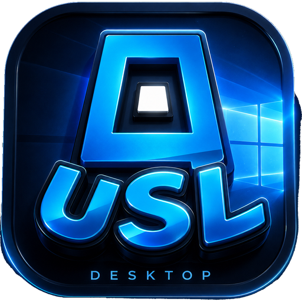

<h1 align="center">USL Desktop</h1>

  
  
  
  

The official **Ultimate Shitty List** desktop client — chat, voice messages, native notifications and system tray, no browser needed.

This repository hosts the release builds of the desktop app. The source lives in the private USL site repository.

## Download

Grab the latest installer from the [releases page](https://github.com/wayago-dev/usl-desktop/releases).

- **Windows** — `USL_Windows_x86_64.exe` (NSIS installer) or `.msi`
- **macOS** — `.dmg`
- **Linux** — AppImage / `.deb` / `.rpm`

The app checks for updates automatically and installs them on restart.

## Features

- The full USL site in one native window
- Native notifications for account and chat updates
- Voice messages and microphone access
- Close to system tray, launch at login
- `usl://` deep links

## Links

- [Ultimate Shitty List](https://ultimateshittylist.fun)
- [USL mod for Geometry Dash](https://github.com/wayago-dev/usl-integration)

## License

MIT
